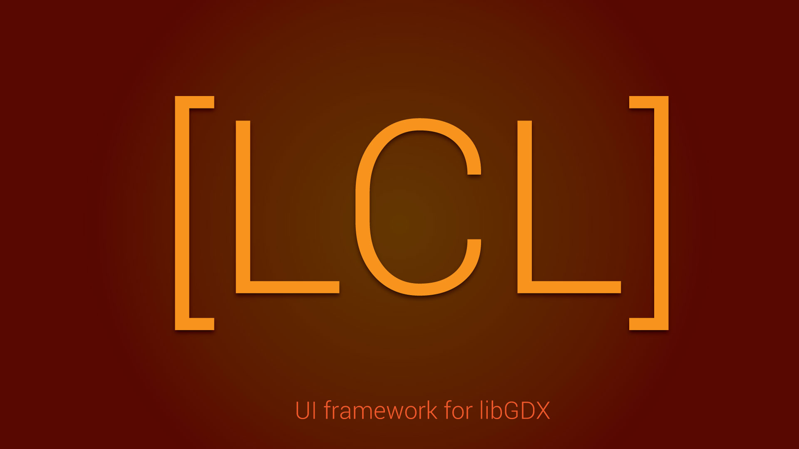

# LCL

A multiplatform UI framework for LibGDX

The library is still in the works so I do not recommend you use it just yet :/

The aim of this library is to provide an alternative to the LibGDX Scene2D UI library and instead offer users more freedom in how they 
develop their UI's. 
Also instead of having extremely complex classes for UI elements we only provide abstractions for the UI elements and certain implementations
but anyone can implement their own design easily or use existent ones. For example you will have a UITextbox abstraction in LCL and a
UITextbox implementation in LCLMaterialDesign which will implement the textbox with a design based on the Material Design Guidlines by
Google.
  
Here is a list of features in the library: 
-Abstractions for transformation, scaling, rotation, rendering, coloring, etc... 
-Animation system based on the Tween Engine and fully compatible with the provided abstractions 
-App logic classes  
-Interfaces for accessing platform specific dialogs 
-Font Manager which manages Bitmap, TrueType and DistanceField Fonts 
-Masking 
-Ninepatches 
-Resource managing 
-Advance virtual keyboard manager for mobile phones 
-Advance event driven layered input system 
-Tuples 
-String manipulation  
-Method chaining  
-Array, Map and Custom Pooling System 
-Reusable thread object 
-Async task executors 
-Timers 
-Object grouping for easy transformations on a group of objects 

